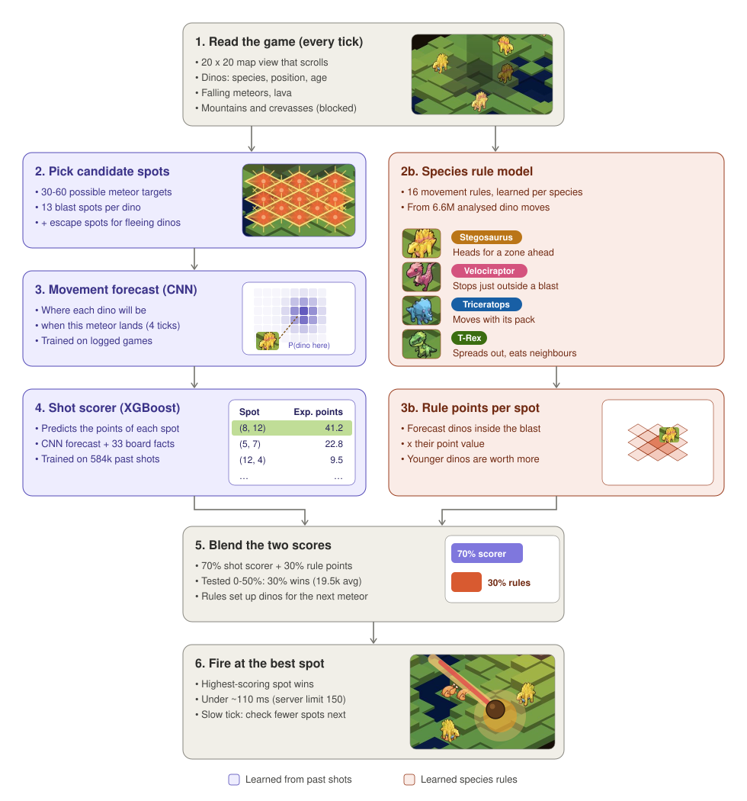

# Coveo Blitz 2027: Dino Disaster Bot 🦖☄️

A game AI for the Coveo Blitz 2027 challenge. Each tick (≈150 ms), the bot sees a 20×20 scrolling map full of dinosaurs and chooses where to drop a meteor. A meteor lands 4 ticks after launch and the dinosaurs see it coming, so the bot has to predict where they **will run**, not where they are.

**Team Costanza** · Python, PyTorch, XGBoost, NumPy

| | Score |
|---|---|
| Best single server game | **28,865** |
| Best bot, server average | **19.5k** (4 games) |
| Starting heuristic bot | ~7k |

---

## How it works



1. **Candidate spots:** every blast position that covers a dinosaur, plus escape spots for dinosaurs already fleeing a meteor. They're ranked by how trapped each dinosaur is, since few escape routes means a high catch rate.
2. **Movement forecast:** a CNN trained on logged games predicts the probability of each dinosaur being on each tile when the meteor lands, given that it reacts to the meteor.
3. **Shot scorer:** an XGBoost model trained on **584k real shots** turns that forecast plus 33 board features (species, ages, escape routes, falling meteors, terrain) into expected points. Exported to plain NumPy, so the bot runs without XGBoost on the server.
4. **Species rule model:** a small softmax model over 16 hand-picked movement rules (escape, avoid edges, packs, T-Rex spreading out…), with weights learned per species. It's a second opinion that CNN doesn't have.
5. **Blend and fire:** a 70/30 blend won server testing. Adaptive timing keeps every tick under the server limit.

---

## What the data showed

All findings come from analysing **1,151 local games and 6.6M dinosaur moves** (`analysis/`):

- **Trapped dinosaurs are the key.** A dinosaur with 0 free escape tiles is caught 97% of the time, against 3% in open ground.
- **Each species moves differently.** Stegosaurus heads for a zone ahead in the window, raptors stop just outside a blast, Triceratops move as a pack, and the T-Rex spreads away from others and eats adjacent prey (70%).
- **Some documented mechanics are false.** Raptors aren't drawn to corpses, and steep impacts don't cause a second shockwave. Every rule was tested before use.
- **Every map is unique** across 3 terrain types. Spawns are random apart from avoiding wall-adjacent tiles.
- **The last 1-2 dinosaurs of a wave** take 28% of the game and were the weakest phase, which drove the mode analysis and the rule model.

---

## How it got here

Each version changed one thing and was judged on server games:

| Step | Idea | Result |
|---|---|---|
| Heuristics | Hand-written targeting | ~7k |
| CNN forecast + trap table | Predict dinosaur movement, favour trapped targets | ~16k |
| Board-mode strategies | Hand rules per situation | ❌ lost to the learned scorer (−3k) |
| XGBoost shot scorer | Learn which shots pay off from 584k shots | 16.1k, +9% locally |
| + Species rule model, 30% blend | Second movement opinion | **19.5k** ✅ |
| Blend weight sweep | 0 / 20 / 25 / 30 / 40 / 50% | 30% best; more than that overrides the scorer |
| In progress | Scorer v2: wave + rule features, server + exploration data | Server AUC 0.84 vs 0.81 |

**Main lesson:** never override the learned model with hand-picked spots. Give it better information and let it decide.

---

## Repository

```
bot/
  candidate_bots/      bot versions (each builds on the previous one)
  infrastructure/      game client, CNN models, state encoding
  models/              trained CNN, XGBoost and rule-model weights
analysis/              game-mechanics studies (modes, species rules, spawns, maps)
training/              dataset builders + training for the CNN, XGBoost and rule model
scripts/               ship.sh (build upload zip), play_local.sh (batch local games)
results/               analysis reports and model evaluations
```

## Run it

```bash
./scripts/ship.sh n14c_rule_blend           # build the upload zip -> dist/
./scripts/play_local.sh n14c_rule_blend 50  # play 50 games against a local server
python analysis/spec_tests.py --logs logs/local_game_logs   # test the movement hypotheses
```
